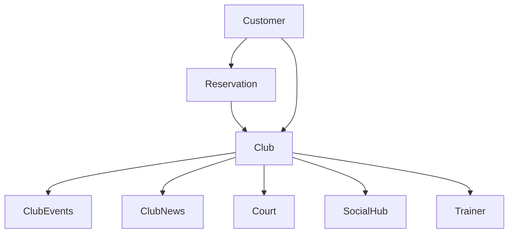
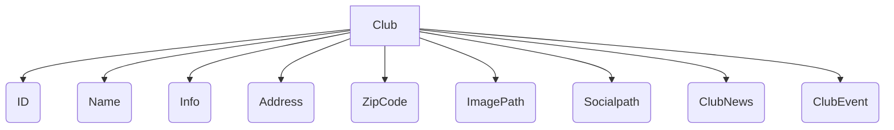
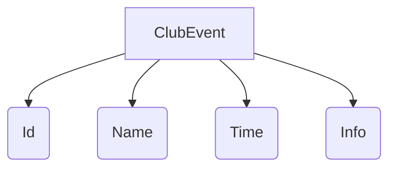
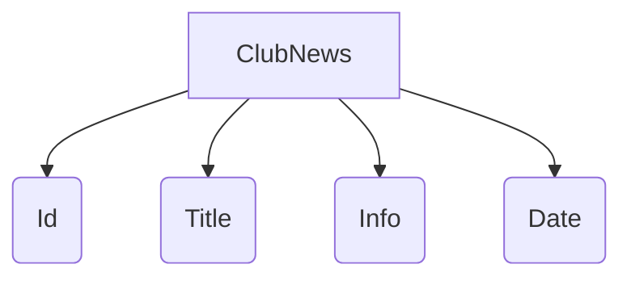
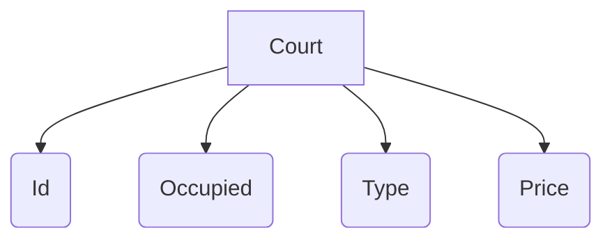
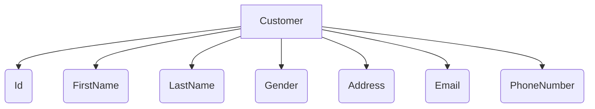
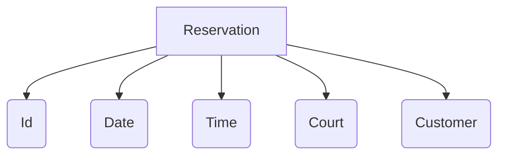
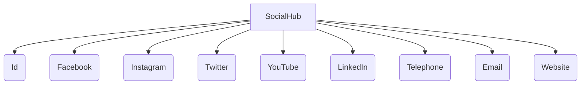
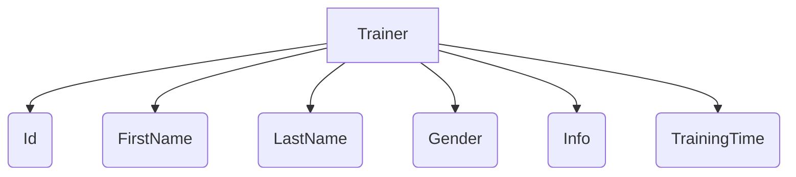

## Database

```mermaid
graph TD
A[Club] --> B[ClubEvents]
A[Club] --> C[ClubNews]
A[Club] --> D[Court]
F[Reservation] --> A[Club]
G[Customer] --> F[Reservation]
G[Customer] --> A[Club]
A[Club] --> H[SocialHub]
A[Club] --> I[Trainer]
```

## Club

```mermaid
graph TD
A[Club]
A --> C(ID)
A --> B(Name)
A --> D(Info)
A --> E(Address)
A --> F(ZipCode)
A --> G(ImagePath)
A --> H(Socialpath)
A --> I(ClubNews)
A --> J(ClubEvent)
```

## ClubEvent

```mermaid
graph TD
A[ClubEvent]
A --> B(Id)
A --> C(Name)
A --> D(Time)
A --> E(Info)
```

## ClubNews

```mermaid
graph TD
A[ClubNews]
A --> B(Id)
A --> C(Title)
A --> D(Info)
A --> E(Date)
```

## Court

```mermaid
graph TD
A[Court]
A --> B(Id)
A --> C(Occupied)
A --> D(Type)
A --> E(Price)
```

## Customer

```mermaid
graph TD
A[Customer]
A --> H(Id)
A --> B(FirstName)
A --> C(LastName)
A --> D(Gender)
A --> E(Address)
A --> F(Email)
A --> G(PhoneNumber)
```

## Reservation

```mermaid
graph TD
A[Reservation]
A --> B(Id)
A --> C(Date)
A --> D(Time)
A --> E(Court)
A --> F(Customer)
```

## SocialHub

```mermaid
graph TD
A[SocialHub]
A --> B(Id)
A --> C(Facebook)
A --> D(Instagram)
A --> E(Twitter)
A --> F(YouTube)
A --> G(LinkedIn)
A --> H(Telephone)
A --> I(Email)
A --> J(Website)
```
## Trainer

```mermaid
graph TD
A[Trainer]
A --> I(Id)
A --> B(FirstName)
A --> C(LastName)
A --> D(Gender)
A --> E(Info)
A --> F(TrainingTime)
```