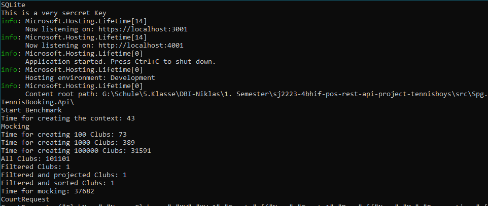
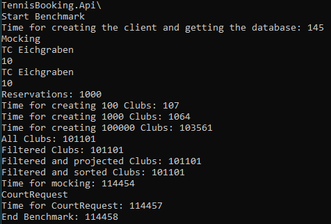

# DBI

## Team Members

- Adrian Schauer
- Fabian Lasser

## Aufgabenstellung

Schritt 1:
Auswahl eines bestehenden rel. Projektes mit skalierbarer seed-Integration Teamarbeit: jeder sucht ein vorhandenes Projekt raus, ich erhalte einen Screenshot vom Datenbankmodell und eine ungefähre Beschreibung des Seedings sowie ein Screenshot des Frontends. Wichtig ist, dass man dieses quasi beliebig skalieren kann. Also zwischen 10 und 100.000 Testfälle für writing-Operationen durchführen kann.

- Tennisplatzverwaltung

Schritt 2:
Nach Auswahl des relationalen Referenzprojektes Implementierung mit einer MongoDB-Schnittstelle der Wahl in der Variante "Optimiert auf Frontend" Musterprojekte für C# und Java sind zu finden unter https://github.com/schletz/Dbi3Sem/tree/master/13_NoSQL/Uebungen/SalesDb/SalesDbGenerator * 1 Punkt für Modell * 1 Punkt für lauffähige Implementierung

- Model ist im Ordner "src\Spg.TennisBooking.Domain\ModelMongo" zu finden und lauffähig

Schritt 3:
Testen der CRUD-Operations sowohl auf json-DB als auch auf relationale DB mit Laufzeiten. Also zuerst * Writings in verschiedenen Skalierungen (100 - 1000 - 100000) , * 4 Finds (ohne Filter, mit Filter, mit Filter und Projektion, mit Filter, Projektion und Sortierung) * 1 Update * 1 Delete alles inkl. Vergleich auf die Relationale DB, dh das Programm kann sowohl relational als auch json-based speichern und Tests hintereinander ausführen. 2 Punkte für gesamten Schritt 3

## Screenshot einiger Datensätze von der MongoDB

## Screenshot vom Laufzeitvergleich (Consolen-print)

### SQL

### MongoDB

### Notiz

SQLite wurde verwendet, daher ist es hier um einiges schneller als bei der MongoDB, da diese keine "echte" Datenbank ist, sondern nur eine Datei und auch somit keine Abfrage auf den localhost gemacht werden muss.

## Bonus

Änderung der Abfrage, sodass eine Aggregation notwendig wird --> Vergleich der Read-Laufzeiten zum selben Query auf der Relationalen. 0.5 Punkte

veränderte Version des Modells, bei dem mit referencing gearbeitet wird und Vergleich der Laufzeiten 0,5 Punkte

- Von sich aus schon Referenzierung verwendet

Umsetzung auf Atlas-Cloud (inkl. Laufzeitvergleiche, also beide DBs auf einer Cloud laufen lassen) 1Punkt

- **Kein Geld dafür**

funktionales Frontend mit Auswahlmöglichkeit der Anzeige (=Filter auf Abfrage) 1.5 Punkte

- Extrem schönes Frontend aber ohne Filter die sind hardcoded bereits mitgegeben und können nur im code geändert werden, da es bereits ein eigenes Projekt war und der MongoDB Teil nur zusätzlich implementiert wurde und im nachhinein deppert das alles mit schönen Filtern zu versehen.

Vergleich der Laufzeiten beim Setzen eines Index auf die Mongo-Struktur 1.0 Punkte

- Index wurde gesetzt auf Attribut "Link"

Irgendwas cooles, das ich hier nicht aufzähle 1 Punkt

- Streams, usefull when working on sockets to detect changes on the mongoDB
